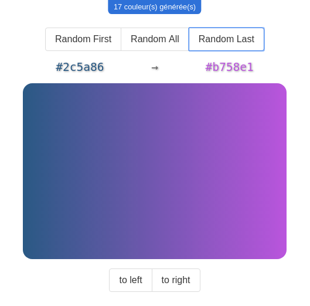
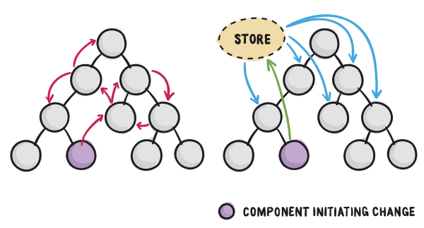

# Store Vanilla

## Comprendre le store

- JS vanilla
- store
- state
- dispatch
- subscribe

## Identifier les composants

- store
- actions
- reducer

# Gradient : actions aux petits oignons

> En repartant du support `gradient`

## Objectifs

- améliorer les actions existantes
- factoriser certains traitements

## Instructions

- ajouter 4 nouveaux boutons pour changer la direction du dégradé
  - 45 degrés
  - 135 degrés
  - 225 degrés
  - 315 degrés
- modifier le reducer et les actions pour gérer toutes les directions avec 1 seule action
- créer l'action creator et s'en servir dans l'interface
